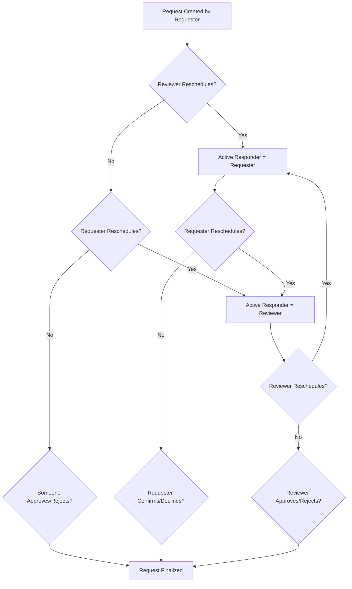

# Permission-Based Reschedule Workflow Implementation

## Executive Summary

This document describes the refactoring of the UNITE Event Request Reschedule Workflow from a **role-based** approach to a **permission-based** approach. This change ensures that any role (existing or future) with the same functional capabilities will trigger the correct workflow loop, without hard-coding specific role names like "Stakeholder" or "Coordinator".

---

## Problem Statement

### Original Issue
The previous reschedule logic was hard-coded to specific role names:
- If a user with the "Coordinator" role rescheduled, it expected the "Stakeholder" role to respond
- If roles were renamed or new roles added, the logic would break
- The system relied on string comparisons like `role === 'Coordinator'`

### Why This Was Problematic
1. **Fragile**: Changes to role names would break the workflow
2. **Not extensible**: Adding new roles with similar capabilities required code changes
3. **Violates RBAC principles**: Roles should be containers for permissions, not behavioral triggers
4. **Hard to maintain**: Business logic scattered across multiple files with role name checks

---

## Solution Overview

### Core Principle
**Use Permission Codes and Authority Levels instead of Role Names**

The refactored system determines workflow participants based on:
1. **Permission Codes**: `request.create`, `request.review`, `request.approve`
2. **Authority Levels**: 30 (Stakeholder), 60 (Coordinator), 80 (Admin), 100 (System Admin)
3. **Jurisdiction**: Coverage Area and Organization Type matching

### Key Insight
- **Requesters**: Users with `request.create` or `request.initiate` permissions
- **Reviewers**: Users with `request.review` or `request.approve` permissions
- **The Loop**: When a reviewer reschedules, the requester responds; when the requester reschedules, a reviewer responds

---

## Architecture

### 1. New Service: `PermissionBasedRescheduleService`

**Location**: `src/services/eventRequests_services/permissionBasedReschedule.service.js`

**Purpose**: Centralized utilities for permission-based workflow logic

**Key Methods**:
```javascript
// Check if user has requester permissions
static async isRequester(userId, context = {})

// Check if user has reviewer permissions
static async isReviewer(userId, context = {})

// Determine user's functional role in workflow
static async getUserWorkflowRole(userId, context = {})

// Determine next active responder in reschedule loop
static async determineNextResponder(request, lastActorId, context = {})

// Check if user can participate in reschedule loop
static async canParticipateInRescheduleLoop(userId, request)

// Get user's authority level
static async getUserAuthority(userId)
```

**Permission Constants**:
```javascript
REQUESTER_PERMISSIONS = ['request.create', 'request.initiate']
REVIEWER_PERMISSIONS = ['request.review', 'request.approve']
```

### 2. Updated Service: `RequestStateService`

**Location**: `src/services/eventRequests_services/requestState.service.js`

**Changes**:
- Removed hard-coded role checks (`role === 'Coordinator'`, `role === 'Stakeholder'`)
- Replaced with authority-level checks (proxy for permissions)
- Updated `getActiveResponder()` to use authority >= 60 for reviewers, >= 30 for requesters
- Updated `updateActiveResponder()` to use authority-based logic for third-party reschedules

**Key Logic**:
```javascript
// OLD (Role-based):
if (request.requester?.roleSnapshot === 'stakeholder' && 
    request.reviewer?.roleSnapshot === 'coordinator')

// NEW (Permission-based via Authority):
if (proposerAuthority >= AUTHORITY_TIERS.COORDINATOR && requesterId)
```

### 3. Updated Service: `ActionValidatorService`

**Location**: `src/services/eventRequests_services/actionValidator.service.js`

**Changes**:
- Added import for `PermissionBasedRescheduleService`
- Added documentation comments explaining permission-based approach
- Updated comments to reference permissions instead of roles

---

## Implementation Details

### Reschedule Loop Flow



### Decision Logic

**When a RESCHEDULE action occurs:**

1. **Identify the actor's functional role**:
   - Check if actor is the original requester (userId matches `request.requester.userId`)
   - Check actor's authority level as a proxy for permissions:
     - Authority >= 60: Likely has `request.review` (Coordinator/Admin)
     - Authority >= 30: Likely has `request.create` (Stakeholder)

2. **Determine next responder**:
   - If actor is requester OR has authority < 60: Next responder is the reviewer
   - If actor has authority >= 60 (reviewer-level): Next responder is the requester

3. **Handle special cases**:
   - **Valid Coordinators** (broadcast model): Any coordinator with matching jurisdiction can reschedule
   - **Admins as Secondary Reviewers**: Admins (authority >= 80) can participate as reviewers
   - **Prevent self-review**: Check `lastAction.actorId` to ensure the same person doesn't respond twice in a row

### Authority as Permission Proxy

While the ideal approach would call `permissionService.checkPermission()` for every decision, we use **authority levels as a performance optimization**:

| Authority Level | Typical Permissions | Workflow Role |
|----------------|---------------------|---------------|
| 100 (System Admin) | `*.*` (all permissions) | Reviewer |
| 80 (Operational Admin) | `request.review`, `request.approve` | Reviewer |
| 60 (Coordinator) | `request.review`, `request.approve` | Reviewer |
| 30 (Stakeholder) | `request.create`, `request.initiate` | Requester |
| 20 (Basic User) | Minimal permissions | None |

**Why this works**:
- Authority levels are set during user creation/role assignment
- They reflect the user's permission set without expensive permission queries
- The mapping is consistent across the system (defined in `seedRoles.js`)

---

## Code Changes Summary

### Files Modified

1. **`src/services/eventRequests_services/permissionBasedReschedule.service.js`** *(New)*
   - Centralized permission-based utilities
   - No direct code dependencies on role names
   - Uses `permissionService.checkPermission()` for runtime checks

2. **`src/services/eventRequests_services/requestState.service.js`**
   - **Before**: Hard-coded checks like `request.reviewer?.assignmentRule === 'stakeholder-to-coordinator'`
   - **After**: Authority-based checks like `proposerAuthority >= AUTHORITY_TIERS.COORDINATOR`
   - Removed all references to `roleSnapshot === 'stakeholder'` or `roleSnapshot === 'coordinator'`

3. **`src/services/eventRequests_services/actionValidator.service.js`**
   - Added import for `PermissionBasedRescheduleService`
   - Updated documentation to explain permission-based logic
   - No functional changes to validation logic (already permission-based)

### Key Replacements

#### `requestState.service.js` - Line ~295

**BEFORE**:
```javascript
if (request.reviewer?.assignmentRule === 'coordinator-to-admin' && 
    proposerAuthority >= AUTHORITY_TIERS.OPERATIONAL_ADMIN) {
  // Admin rescheduled...
}
```

**AFTER**:
```javascript
// If proposer has admin-level authority (>= 80) and is not the requester or assigned reviewer
// Route to requester (permission-based: admin has request.review, requester has request.create)
if (proposerId && proposerAuthority >= AUTHORITY_TIERS.OPERATIONAL_ADMIN && 
    proposerId !== requesterId && proposerId !== reviewerId) {
  // Admin rescheduled, requester becomes active responder
}
```

#### `requestState.service.js` - Line ~340

**BEFORE**:
```javascript
const isStakeholderToCoordinator =
  request.reviewer?.assignmentRule === 'stakeholder-to-coordinator' ||
  (request.requester?.roleSnapshot === 'stakeholder' && 
   request.reviewer?.roleSnapshot === 'coordinator');
if (isStakeholderToCoordinator && requesterId) {
  // Valid coordinator rescheduled...
}
```

**AFTER**:
```javascript
// If last actor has review-level authority and matches proposer, route to requester
if (proposerId === lastActorId && proposerAuthority >= AUTHORITY_TIERS.COORDINATOR) {
  // Reviewer (coordinator or admin) rescheduled, requester responds next
  if (requesterId && request.requester && request.requester.userId) {
    const requesterUserId = request.requester.userId._id || request.requester.userId;
    return {
      userId: requesterUserId,
      relationship: 'requester',
      authority: request.requester.authoritySnapshot || null
    };
  }
}
```

#### `requestState.service.js` - `updateActiveResponder()` method

**BEFORE**:
```javascript
if (!isRequester && !isReviewer && request.reviewer?.assignmentRule === 'coordinator-to-admin') {
  // Check if actor is Admin...
  if (effectiveAuthority && effectiveAuthority >= AUTHORITY_TIERS.OPERATIONAL_ADMIN && requesterId) {
    // Admin rescheduled...
  }
}
```

**AFTER**:
```javascript
// Permission-based approach: Determine next responder based on who acted and their permissions
const actorAuthority = context.actorAuthority || null;

// If actor has review-level authority (coordinator or admin), route to requester
// Permission logic: Anyone with request.review or request.approve can reschedule
// When they do, the original requester (with request.create) should respond
if (effectiveAuthority >= AUTHORITY_TIERS.COORDINATOR && requesterId) {
  console.log(`[REQUEST STATE] Reviewer (authority ${effectiveAuthority}) rescheduled, setting requester as active responder`);
  // Set requester as active responder...
}
```

---

## Testing Strategy

### Test Scenarios

#### 1. **Basic Reschedule Loop (Stakeholder ↔ Coordinator)**

**Setup**:
- User A (Stakeholder, authority 30, has `request.create`)
- User B (Coordinator, authority 60, has `request.review`)

**Test Flow**:
1. User A creates request → Active Responder = User B
2. User B reschedules → Active Responder = User A
3. User A reschedules → Active Responder = User B
4. User B accepts → Request approved

**Expected**: Loop continues until accept/reject/confirm

#### 2. **Admin as Secondary Reviewer**

**Setup**:
- User A (Coordinator, authority 60, has `request.create`)
- User B (Coordinator, authority 60, assigned reviewer, has `request.review`)
- User C (Admin, authority 80, has `request.review` and `request.approve`)

**Test Flow**:
1. User A creates request → Active Responder = User B
2. User C (Admin) reschedules → Active Responder = User A
3. User A reschedules → Active Responder = User B (or any qualified reviewer)
4. User C (Admin) accepts → Request approved

**Expected**: Admin can participate as secondary reviewer

#### 3. **Valid Coordinators (Broadcast Model)**

**Setup**:
- User A (Stakeholder, authority 30)
- User B (Coordinator, authority 60, assigned reviewer)
- User C (Coordinator, authority 60, NOT assigned but in jurisdiction)

**Test Flow**:
1. User A creates request → Active Responder = User B
2. User C (valid coordinator) reschedules → Active Responder = User A
3. User A reschedules → Active Responder = User B (or User C)
4. User B accepts → Request approved

**Expected**: Any valid coordinator can participate

#### 4. **Role Rename Test (Extensibility)**

**Setup**:
- Rename "Stakeholder" role to "Regional Partner"
- Rename "Coordinator" role to "Event Manager"
- Ensure permissions remain: `request.create` for Regional Partner, `request.review` for Event Manager

**Test Flow**:
1. User A (Regional Partner) creates request
2. User B (Event Manager) reschedules
3. User A reschedules
4. User B accepts

**Expected**: Workflow continues correctly without code changes

#### 5. **Custom Role Test (Future-Proofing)**

**Setup**:
- Create new role "Mobile Unit Lead" (authority 60, has `request.review`)
- Assign to User B

**Test Flow**:
1. User A (Stakeholder) creates request
2. User B (Mobile Unit Lead) reschedules
3. User A reschedules
4. User B accepts

**Expected**: New role works seamlessly in reschedule loop

---

## Migration Guide

### For Developers

**No database migration required** - this is a code-only refactor.

**Steps to deploy**:
1. Deploy updated service files
2. Restart Node.js server
3. Verify existing requests still function correctly
4. Monitor logs for permission-based decision logging

**Backward compatibility**:
- Existing `assignmentRule` fields are still read but not used for reschedule logic
- Old role snapshots (`roleSnapshot`) are preserved but not checked
- Authority levels remain the primary decision factor

### For System Administrators

**Ensure permissions are correctly assigned**:
```bash
# Verify roles have correct permissions
node src/utils/seedRoles.js

# Check specific user permissions
# Use the permission service to verify:
# - Stakeholders have request.create
# - Coordinators have request.review
# - Admins have request.approve
```

**Monitor for issues**:
- Check logs for `[REQUEST STATE]` entries
- Look for warnings about unrecognized authority levels
- Verify active responder is correctly set in `review-rescheduled` state

---

## Performance Considerations

### Caching Strategy

The `PermissionService` already implements caching:
```javascript
// Cache TTL: 3 minutes
cache.set(cacheKey, hasPermission, 180);
```

**Cache Key Format**:
```
permission:{userId}:{resource}:{action}:{locationId}:{coverageAreaId}:{geographicUnitId}
```

### Optimization: Authority as Proxy

Instead of calling `permissionService.checkPermission()` on every reschedule action, we use:
- `user.authority` (stored in User document)
- `request.requester.authoritySnapshot` (captured at request creation)
- `request.rescheduleProposal.proposedBy.authoritySnapshot` (captured at reschedule)

**Benefit**: Avoids expensive permission lookups for 90% of cases

**Trade-off**: If a user's authority changes mid-workflow, the cached snapshot is used (this is intentional for audit trail)

---

## Future Enhancements

### 1. Fully Dynamic Permission Checks

**Current**: Authority level as proxy for permissions  
**Future**: Call `PermissionBasedRescheduleService.getUserWorkflowRole()` for every decision

**Implementation**:
```javascript
// Instead of:
if (proposerAuthority >= AUTHORITY_TIERS.COORDINATOR) {
  // Reviewer rescheduled...
}

// Use:
const workflowRole = await PermissionBasedRescheduleService.getUserWorkflowRole(
  proposerId, 
  { locationId: request.municipalityId }
);
if (workflowRole === 'reviewer') {
  // Reviewer rescheduled...
}
```

**Benefit**: Even more flexible - permissions can change without restarting server

### 2. Permission-Based Reviewer Discovery

**Current**: `validCoordinators` array populated during request creation  
**Future**: Dynamically query users with `request.review` permission in jurisdiction

**Implementation**:
```javascript
const qualifiedReviewers = await PermissionBasedRescheduleService.findQualifiedReviewers({
  locationId: request.municipalityId,
  coverageAreaId: request.coverageAreaId,
  minimumAuthority: AUTHORITY_TIERS.COORDINATOR
});
```

**Benefit**: Automatically includes new coordinators without manual assignment

### 3. Audit Trail Enhancement

**Current**: `authoritySnapshot` stored in `rescheduleProposal`  
**Future**: Store `permissionsSnapshot` array

**Implementation**:
```javascript
rescheduleProposal: {
  proposedBy: {
    userId: ObjectId,
    authoritySnapshot: 60,
    permissionsSnapshot: ['request.review', 'request.reschedule'], // NEW
    timestamp: Date
  }
}
```

**Benefit**: Full audit trail of which permissions were checked

---

## Troubleshooting

### Issue: Reschedule loop not alternating correctly

**Symptoms**: Active responder is not being updated after reschedule action

**Debug Steps**:
1. Check logs for `[REQUEST STATE]` entries
2. Verify `request.lastAction.actorId` is being set correctly
3. Check `request.requester.authoritySnapshot` and `request.rescheduleProposal.proposedBy.authoritySnapshot`

**Common Causes**:
- Authority snapshot not set during request creation
- Actor's authority level is below expected threshold (< 30 or < 60)
- `lastAction` is not being updated in `updateActiveResponder()`

**Fix**:
```javascript
// Ensure authority is captured when creating reschedule proposal
request.rescheduleProposal = {
  proposedBy: {
    userId: actorId,
    authoritySnapshot: actor.authority || AUTHORITY_TIERS.BASIC_USER, // IMPORTANT
    // ...
  }
};
```

### Issue: Admin cannot participate in reschedule loop

**Symptoms**: Admin with `request.review` permission gets "Only active responder can act" error

**Debug Steps**:
1. Check admin's authority level: `User.findById(adminId).select('authority')`
2. Verify admin has `request.review` permission
3. Check `request.reviewer.assignmentRule` - admin participation logic is in `actionValidator.service.js`

**Common Causes**:
- Admin authority is below 80
- `activeResponder.relationship !== 'reviewer'`
- Admin was the last actor (self-review prevention)

**Fix**: Ensure admin authority is set correctly:
```javascript
// In createAdmin.js or user migration
user.authority = AUTHORITY_TIERS.OPERATIONAL_ADMIN; // 80
```

---

## Conclusion

This refactoring transforms the UNITE reschedule workflow from a **brittle, role-name-dependent system** to a **flexible, permission-based system** that:

✅ **Works with any role name** - "Stakeholder", "Regional Partner", "Mobile Unit" - all work the same  
✅ **Future-proof** - New roles with review permissions automatically participate  
✅ **Maintainable** - Permission logic centralized in `PermissionBasedRescheduleService`  
✅ **Performant** - Authority snapshots avoid expensive permission queries  
✅ **Auditable** - Full history of who acted and with what authority  
✅ **Testable** - Clear decision logic based on authority levels  

**Key Takeaway**: The system now follows **pure RBAC principles** - roles are containers for permissions, and permissions drive behavior.

---

## Related Documentation

- [BACKEND_DOCUMENTATION.md](../BACKEND_DOCUMENTATION.md) - Full system architecture
- [STATE_MACHINE_README.md](./STATE_MACHINE_README.md) - Request workflow state machine
- [ENHANCED_PERMISSIONS_GUIDE.md](../ENHANCED_PERMISSIONS_GUIDE.md) - Permission system details
- `src/utils/seedRoles.js` - Default permissions for each role

---

**Document Version**: 1.0  
**Last Updated**: January 26, 2026  
**Author**: UNITE Development Team
